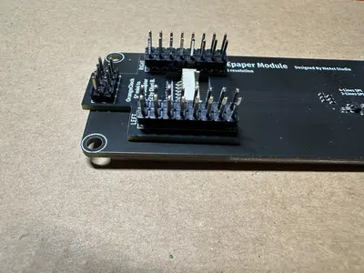
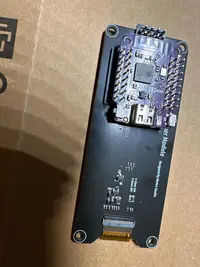
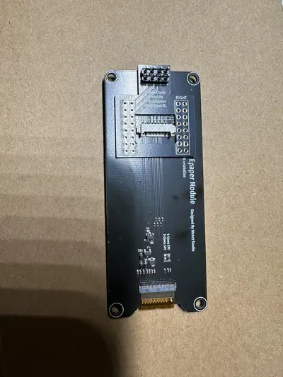

# Orangeclock S* mini to EPD adapter






## Pins S2 mini

```
RST_PIN         = 3
DC_PIN          = 2
CS_PIN          = 4
BUSY_PIN        = 1
```

## Pins S3 mini

```
RST_PIN         = 2
DC_PIN          = 3
CS_PIN          = 5
BUSY_PIN        = 1
```